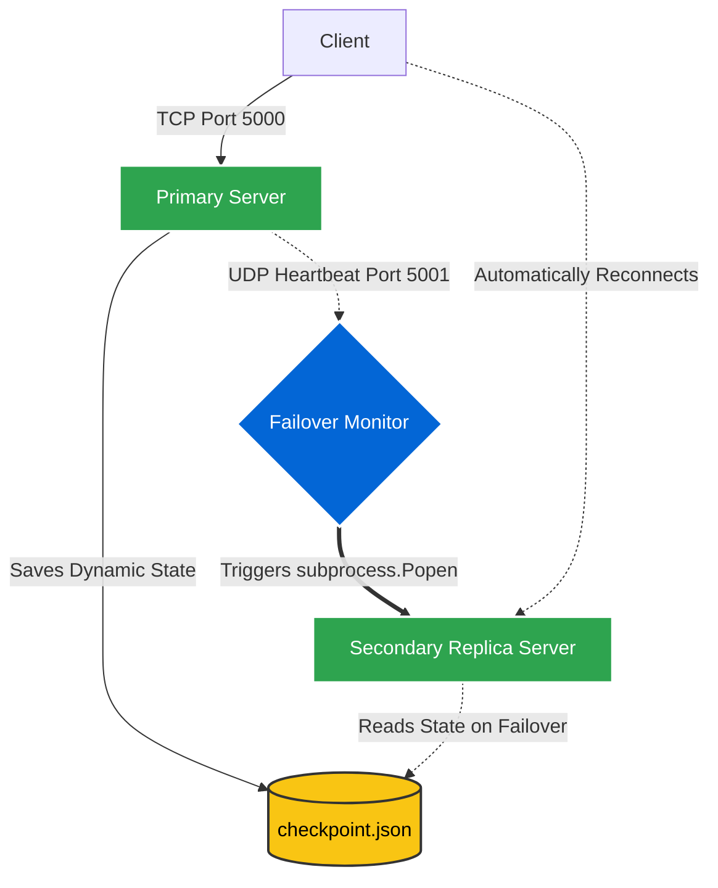

```mermaid
graph TD
    Client["Client"] -->|"TCP Port 5000"| Primary["Primary Server"]
    Primary -->|"Saves Dynamic State"| Checkpoint[("checkpoint.json")]
    Primary -.->|"UDP Heartbeat Port 5001"| Monitor{"Failover Monitor"}
    
    Monitor ==>|"Triggers subprocess.Popen"| Replica["Secondary Replica Server"]
    Replica -.->|"Reads State on Failover"| Checkpoint
    Client -.->|"Automatically Reconnects"| Replica
    
    classDef main fill:#2ea44f,stroke:#fff,stroke-width:2px,color:#fff;
    classDef monitor fill:#0366d6,stroke:#fff,stroke-width:2px,color:#fff;
    classDef file fill:#f9c513,stroke:#333,stroke-width:2px,color:#000;
    
    class Primary main;
    class Replica main;
    class Monitor monitor;
    class Checkpoint file;
```
